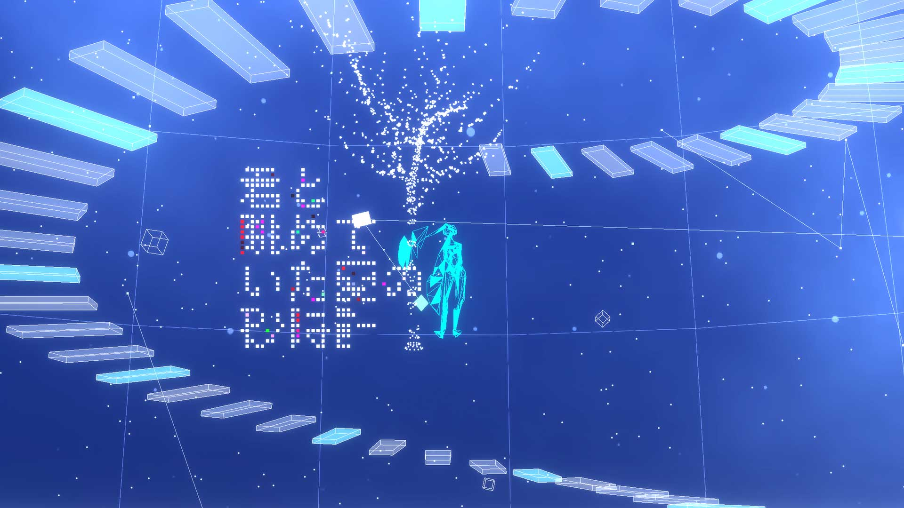
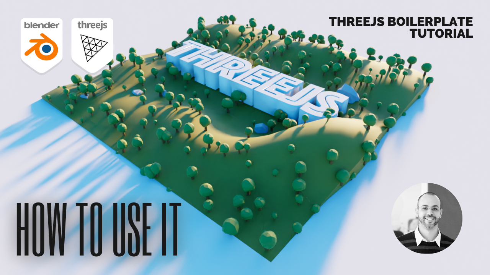

# Magical Universe
<h4>This Music-App is programmed by Ryo Misora</h4>

<p align="center">
    
</p>

##  イントロダクション

タイトル：**Magical Universe（マジカルユニバース）**

楽曲：Loading Memories / せきこみごはん feat. 初音ミク

楽曲と世界観をたのしむWEBアプリケーリョンを作りました。

抽象的な初音ミクを中心に、楽曲から宇宙をテーマに選んび、未来に向けて、だんだんと階段を登っていき、桜を咲かしていくこと表現しています。

空間に浮遊しているCube（キューブ）をクリックすることで、そのCubeの位置に視点を変更することができます。
楽しみ方として、白いcubeを集めていくことで、徐々に大きなオブジェが形成され、キャラのシルエットが埋まっていきます。
集め方は簡単で、白いcubeをクリックして、中央部分の八面体（最初にクリックした黄色のオブジェクト）をクリックするだけです。

ぜひ、曲が終わるまでにオブジェの完成を目指して、ダイナミックな演出で楽曲をお楽しみください。

Resources: [Three.js](https://threejs.org/), [GSAP](https://greensock.com/), [Mixamo](https://www.mixamo.com/), [TextAlive](https://textalive.jp/)

## Demo

<https://misora.main.jp/procon/>


##  Movie
Here you can see a video on how to use this
<a href="https://www.youtube.com/embed/qM6Ih_cC6Gc" target="_blank"></a>


##  開発
Download and install Node.js on your computer (https://nodejs.org/).

Then, open VSCODE, drag the project folder to it. Open VSCODE terminal and install dependencies (you need to do this only in the first time)
```
npm install
```

Run this command in your terminal to open a local server at localhost:8080
```
npm run dev
```

##  ビルド
以下のコマンドで dist 以下にビルド済みファイルが生成されます。 サンプルコードのデモページ は レンタルサーバー で、このリポジトリの dist 以下のファイルが提供されています。

```
npm run build
```

Run this command in your terminal to generate pre-built files under dist folder.


##  ポイント

### 楽曲との同期

1. **カメラの移動時間とビートの同期**： 移動完了のタイミングを拍子の開始に合わせて移動を完了するように設計。気持ちの良い移動を実現しています。

2. **らせん階段の演出**： 拍子に合わせて、各階段の透明度で時間的変化を表示しています。セグメントのよるサビのときには、盛り上げる演出のためカラーを変化させています。

3. **キャラクターのボーカルの声量による揺れ**： キャラクターのボーカルの声量によって、キャラクターの形状に揺れが生じます。歌の熱量をビジュアルで表現しています。

4. **キャラクターのアニメーション設定**： セグメントのよる分類を、各キャラクターのアニメーション演出の分岐に利用しています。この分岐を起点にユーザーの好きなアニメーションパターンに設定することを可能としています。現在は４種類のアニメーションを設定していますが、もっと多くのアニメーションを設定追加することができます。（mixamoのアニメーションデータを利用しています）

5. **歌詞表現**： 世界観に合わせて、パーティクルで消えていく歌詞（フレーズ）表現を採用しました。ランダム性とカラーリングで独自の表現を目指して設計しました。


### そのほか

1. **汎用性を持って設計**： 「Loading Memories / せきこみごはん feat. 初音ミク」に合わせて、世界観など設定しておりますが、複数の楽曲に対応できるように汎用性をもたせて設計しています。以下の楽曲でも、対応可能です。
  - 歌の欠片と / imo feat. MEIKO
  - みはるかす / ねこむら（cat nap） feat. 初音ミク
  - fear / 201 feat. 初音ミク

2. **演出**：


## 仕様

### スタートとストップ

初期起動時の中央の八面体、もしくは左下のPLAYアイコンで楽曲の再生、左下のSTOPアイコンで停止ができます。


### 白いCubeとワイヤーフレームのCube

どちらのcubeもクリック可能で、その位置に視点が移動します。
白いCubeは演出で使うパラメータを持っていて、クリックした数で演出に影響するようになっています。
また、中央の八面体をクリックするごとに、ランダムに白いCubeを選出しています。（Cubeは全部で２０個浮遊しています）


### キャラクターのMeshとさくらの木について

白いキューブを１回クリックして、中央の八面体をクリックするごとに、２０枚のキャラクターのMeshが埋まる設定です。同じcubeをクリックしてもカウントされます。ワイヤーフレームのcubeは、Meshを埋めるのにカウントされません。中央の八面体をクリックで実行される仕組みです。

キャラクターのMeshは、初期状態で４６０枚のMeshの穴が空いています。完全に埋めるには、23回(20*23=460)の白いCubeをクリックする必要があります。
さくらの木は、５段階で変化する仕様になっています。キャラクターのメッシュ数と連動している仕組みですが、キャラのメッシュは埋まっても少なくとも４回は中央の八面体をクリックしないと５段階まで成長しません。


【１段階目】デフォルト（再生時に起動）

【２段階目】白いcube２回以上クリック＋中央の八面体

【３段階目】白いcube４回（累計６回以上）＋中央の八面体

【４段階目】白いcube６回（累計１２回以上）＋中央の八面体

【５段階目】白いcube１０回（累計２２回以上）＋中央の八面体


曲が終わると、すべて初期化されます。


## 動作要件

PCでの閲覧を推奨しています。

場合によっては高負荷になることもございます（グラフィックボード有りが望ましいです）。うまく表示されなかったり、文字が出ない場合などは、リロードなどしていただけると回復することがあります。

＊スマホでも閲覧可能

＊PCで閲覧の場合、Safariブラウザでは極端にFPSが下がる場合がございます。（Three.jsとMac_OSのバグで解決策がわかりません）ChromeまたはFirefoxを推奨しています。
